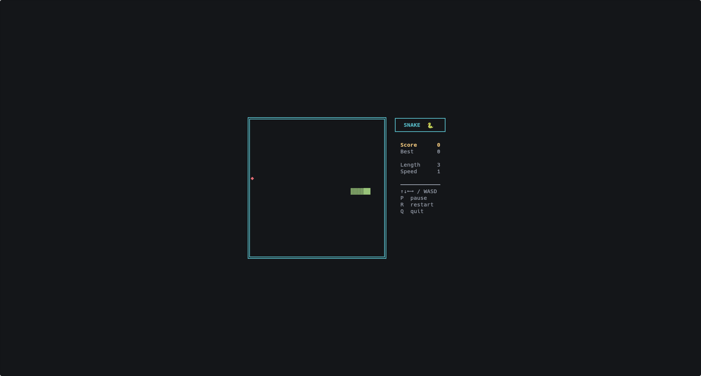
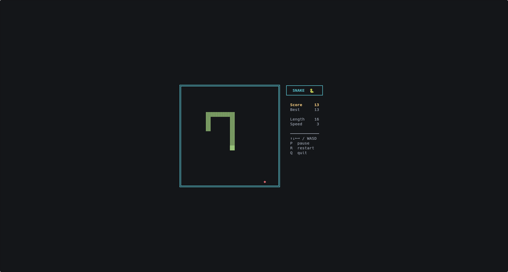
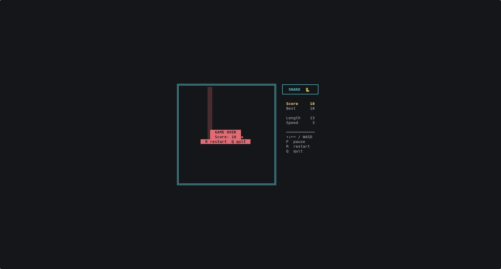

# 🐍 Snake

A classic Snake game that runs entirely in your terminal, built with Python's standard library. No dependencies required.



---

## Features

- Square, evenly-spaced cells — movement feels the same in all directions
- Speed increases every 5 points, shown live in the side panel
- High score tracked across restarts in the same session
- Pause and resume at any time
- Game-over overlay with instant restart
- Centres itself automatically to whatever terminal size you're using

---

## Requirements

- Python 3.6+
- No third-party packages — uses only the standard library

> **Linux:** if you see a `_curses` import error, install the curses package for your distro:
> ```bash
> sudo apt install python3-curses   # Debian / Ubuntu
> sudo dnf install python3-curses   # Fedora
> ```
>
> **Windows:** `curses` is not bundled with the standard library. Install the Windows port first:
> ```bash
> pip install windows-curses
> ```

The terminal must be at least **46 × 22** characters — most defaults are well above this.

---

## Running

```bash
python snake.py
```

---

## How to play

| Key | Action |
|-----|--------|
| Arrow keys or `W A S D` | Steer |
| `P` | Pause / unpause |
| `R` | Restart *(after game over)* |
| `Q` | Quit |

Eat the red `◆` food to grow and score points. Hitting a wall or your own body ends the game.

---

## Screenshots

**Starting position**


**In play**



**Game over**



---

## How it works

The game loop runs at ~60 fps for smooth redraws, but the snake only advances on a separate tick timer. At speed 1 that's roughly 7–8 moves per second, increasing by a fixed step for every 5 points scored (capped at a minimum delay of 50 ms).

Each grid cell is rendered as two terminal columns wide to compensate for the roughly 2:1 height-to-width ratio of a terminal character, keeping segments visually square and movement speed consistent in all four directions.

---

## License

MIT
